# 🍻 Let's Meet! 🎉 #

## Progetto di Applicazioni Software e Programmazione per Dispositivi Mobili ##

### Appello: ###
* Primo appello, Sessione Invernale 2021/2022

### Studente: ###
* [Andrea De Luna](https://github.com/andreadeluna)
* Matricola: 313076

-----------------------------------------------------

## Obiettivo ##
Lo scopo del progetto consiste nell'implementazione di un'applicazione che consenta a dei locali di creare eventi di intrattenimento, al quale gli utenti possano iscriversi per potervi partecipare. Gli utenti si dividono in due tipi, ossia Admin e User.
Gli utenti di tipo Admin saranno in grado di creare, gestire ed eliminare gli eventi, visualizzare i dati personali, e visualizzare la lista degli utenti iscritti ad ogni evento.
Gli utenti User invece, saranno in grado di visualizzare e di iscriversi ai relativi eventi disponibili. Oltre a questo, saranno in grado di visualizzare i dati personali, la lista degli eventi al quale sono iscritti, i dettagli degli eventi presenti e la relativa posizione del locale all'interno di una mappa. Inoltre, nel momento in cui l'utente si iscrive ad un evento visualizzerà un messaggio contenente un codice personale, il quale gli consentirà di fruire di un ipotetico sconto su una consumazione a seguito di presentazione all'ingresso nel locale.

-----------------------------------------------------

## Casi d'uso ##
I casi d'uso possono essere suddivisi rispettivamente per tipologia di utente, verranno proposti i più significativi:

### Utente Admin ###
- Primo caso
  * Apertura applicazione
  * Login
  * Creazione di uno o più nuovi eventi
  * Visualizzazione profilo
  * Visualizzazione iscritti ad un evento
  * Logout
  * Chiusura applicazione

- Secondo caso
  * Apertura applicazione
  * Login
  * Eliminazione di uno o più eventi
  * Logout
  * Chiusura applicazione

### Utente User ###
- Primo caso
  * Apertura applicazione
  * Login
  * Iscrizione ad un evento
  * Logout
  * Chiusura applicazione

- Secondo caso
  * Apertura applicazione
  * Login
  * Visualizzazione lista iscrizioni
  * Visualizzazione dettagli di un evento
  * Visualizzazione luogo di svolgimento dell'evento
  * Logout
  * Chiusura applicazione

-----------------------------------------------------

## Esperienza utente ##

### Splash screen ###
La schermata di apertura dell'applicazione è la splash screen, che verrà visualizzata per 2 secondi e mostrerà il nome dell'app e la relativa icona. Al termine del caricamento l'utente verrà indirizzato alla schermata di login, nel caso in cui sia sloggato al momento dell'apertura dell'app, oppure alla pagina principale, ossia la home in caso di utente di tipo User, o il pannello admin in caso di utente di tipo Admin.

  <row>
    <a>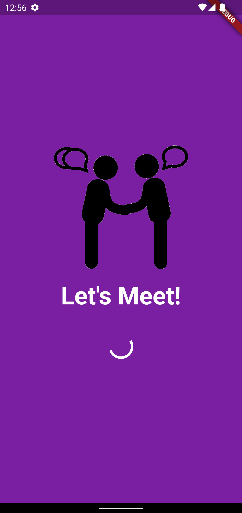</a>
  </row>

### Pagina iniziale ###
La pagina iniziale, o pagina di autenticazione, è composta da una Bottom Navigation Bar, che consente di scegliere se effettuare il login oppure se effettuare una nuova registrazione. Entrambe le schermate sono composte da un form atto all'inserimento dei dati.

  <row>
    <a>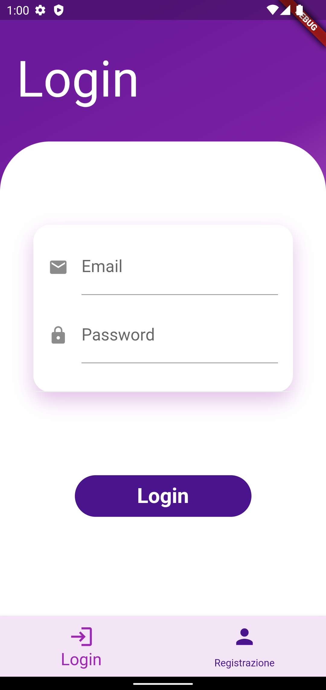</a>
    <a>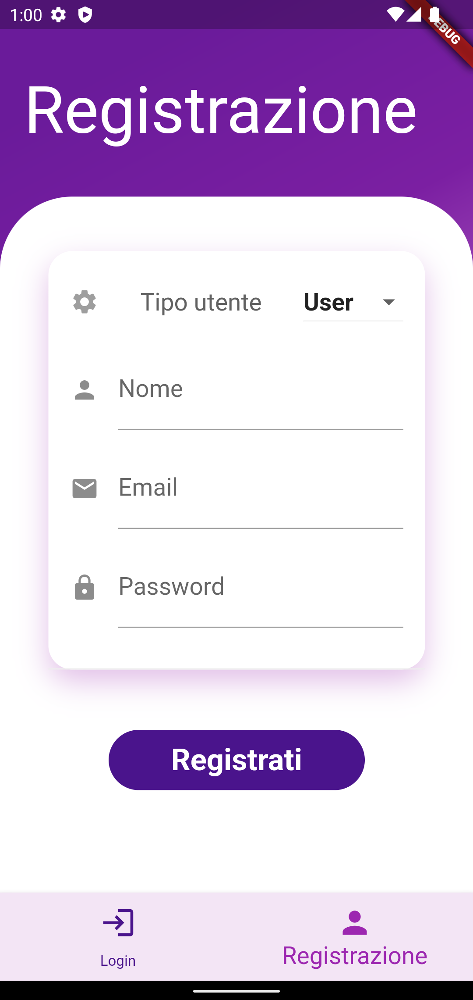</a>
  </row>

Nel caso in cui i dati inseriti siano errati o incompleti, verà visualizzato un messaggio di errore.

  <row>
    <a>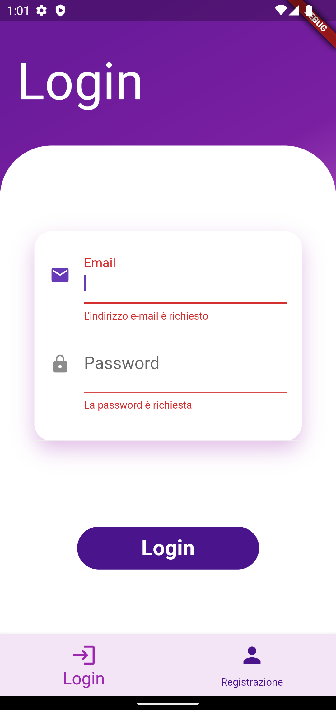</a>
    <a>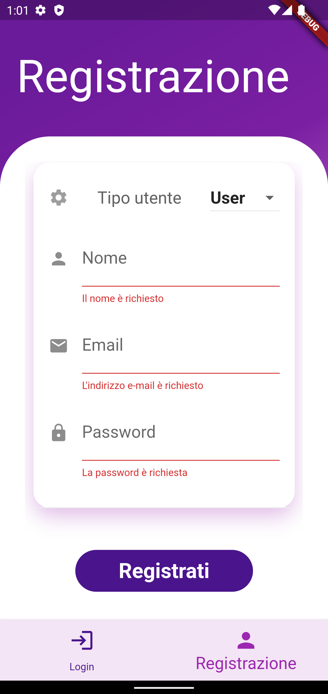</a>
  </row>

Nel caso in cui vengano rilevati problemi con l'autenticazione (ad esempio password errata in fase di login, oppure esistenza di un utente con la stessa password inserita in fase di registrazione), verrà visualizzato un messaggio di errore contenente l'eccezione ricevuta da Firebasse.

  <row>
    <a>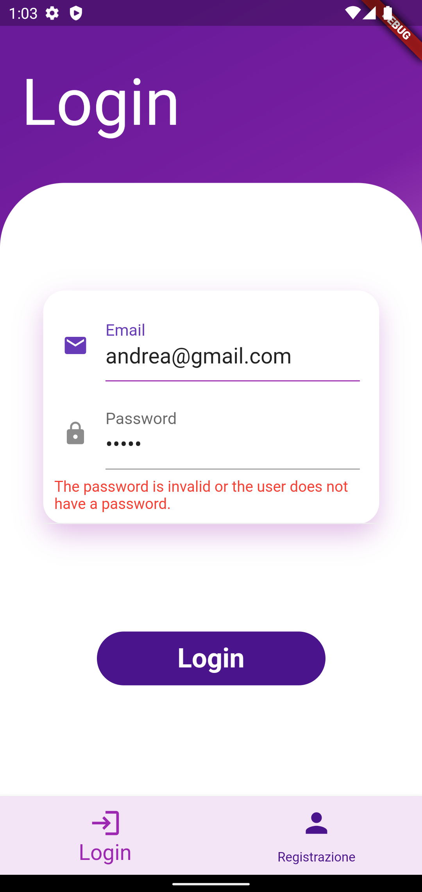</a>
    <a>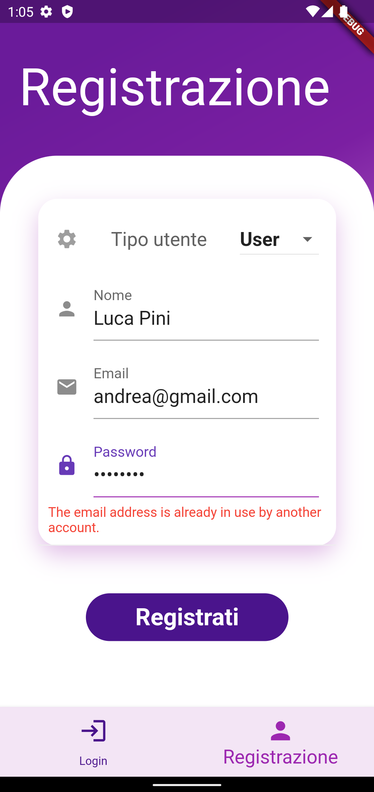</a>
  </row>

### Pannello Admin ###
Nel caso in cui l'utente sia di tipo Admin, verrà indirizzato alla schermata Pannello Admin, che consentirà di gestire gli eventi. In particolare, all'apertura della schermata verranno visualizzati gli eventi esistenti mediante uno StreamBuilder, il quale ne consentirà la visualizzazione con aggiornamento in tempo reale.

  <row>
    <a>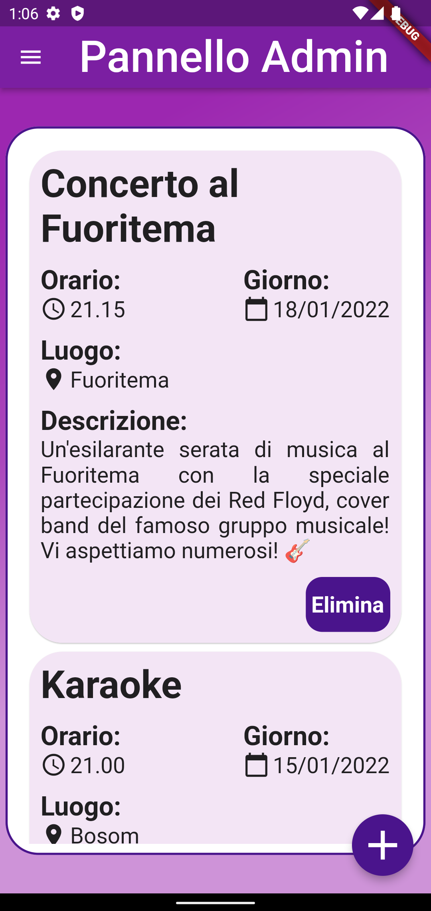</a>
  </row>

All'interno delle card contenenti le informazioni degli eventi sarà presente un pulsante, il quale consentirà l'eliminazione dell'evento selezionato. L'eliminazione avverrà a seguito della conferma della scelta definita mediante la visualizzazione di una AlertDialog.

  <row>
    <a>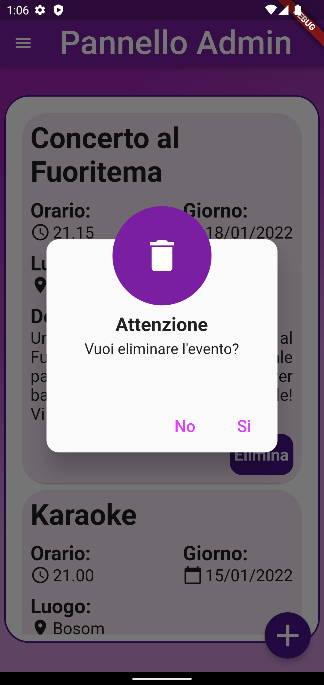</a>
  </row>

### Creazione evento ###
La schermata Pannello Admin sarà corredata di un FloatingButton, il quale, se selezionato, permetterà di visualizzare una bottom sheet che consentirà di creare nuovi eventi tramite un form.

  <row>
    <a>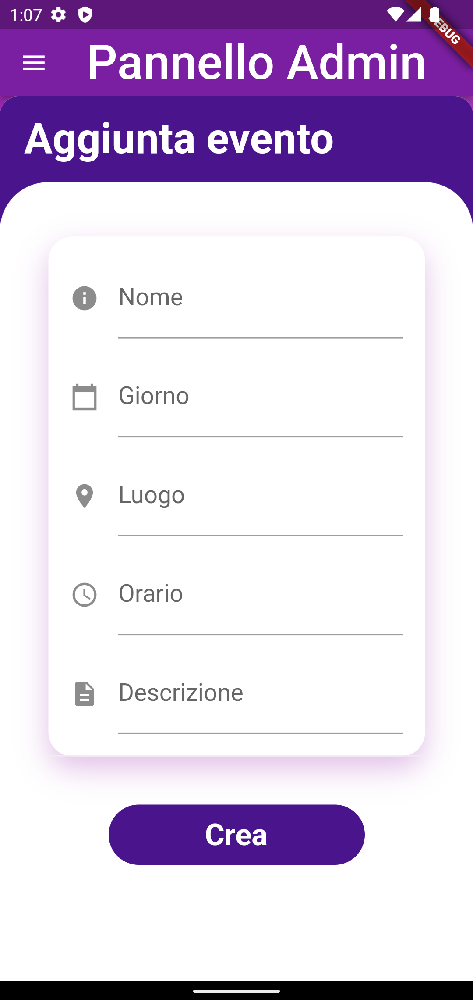</a>
  </row>

Nel caso in cui i dati inseriti siano errati o incompleti, verrà visualizzato un messaggio di errore.

  <row>
    <a>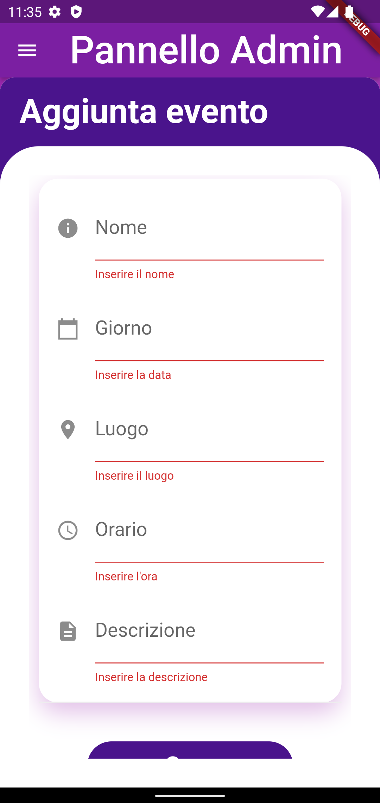</a>
  </row>

### Lista iscritti ###
Selezionando un evento all'interno del Pannello Admin sarà possibile visualizzare una lista contenente i nomi e i relativi codici degli utenti iscritti fino a quel momento. La visualizzazione è resa possibile grazie ad uno StreamBuilder, il quale ne consentirà la visualizzazione aggiornata in tempo reale.

  <row>
    <a>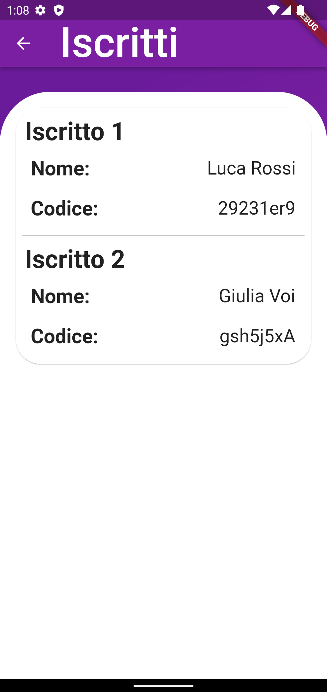</a>
  </row>

### Home ###
Nel caso in cui l'utente sia di tipo User, verrà indirizzato alla schermata Home, che consentirà l'iscrizione agli eventi. In particolare, all'apertura della schermata verranno visualizzati gli eventi esistenti mediante uno StreamBuilder, il quale ne consentirà la visualizzazione con aggiornamento in tempo reale.

  <row>
    <a>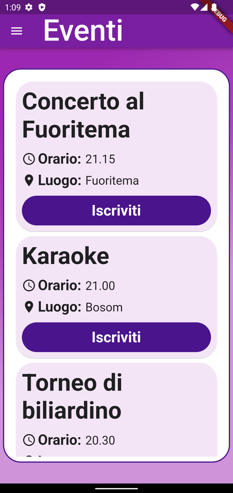</a>
  </row>

All'interno delle card contenenti le informazioni degli eventi sarà presente un pulsante, il quale consentirà l'iscrizione all'evento selezionato. L'iscrizione verrà notificata mediante la visualizzazione di una AlertDialog.

  <row>
    <a>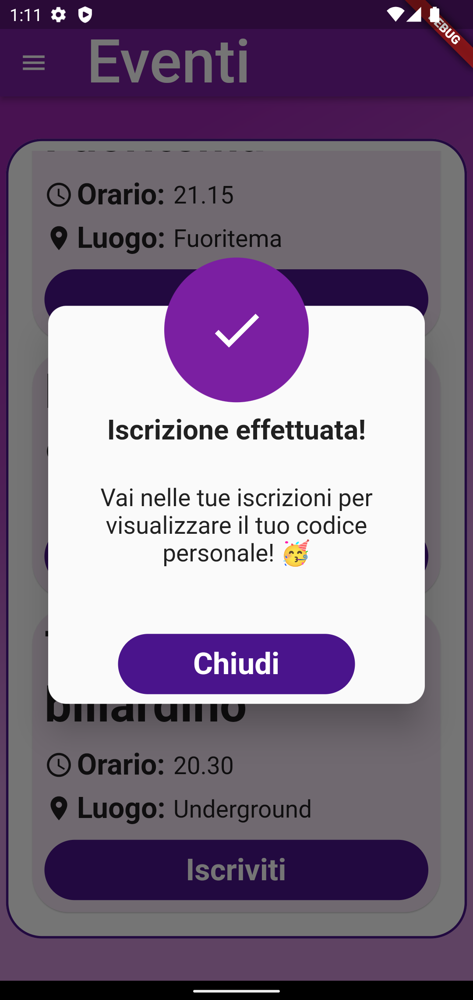</a>
  </row>

### Dettagli evento ###
Selezionando un evento all'interno della Home sarà possibile visualizzarne i dettagli. Oltre ai dati inseriti dall'Admin, sarà possibile visualizzare dei dati di informazione quali numero di telefono e indirizzo del locale nel quale si svolgerà l'evento, recuperati grazie al collegamento all'API [LetsOrder](https://github.com/andreadeluna/ProgettoPDGT/tree/master/LetsOrderAPI).

  <row>
    <a>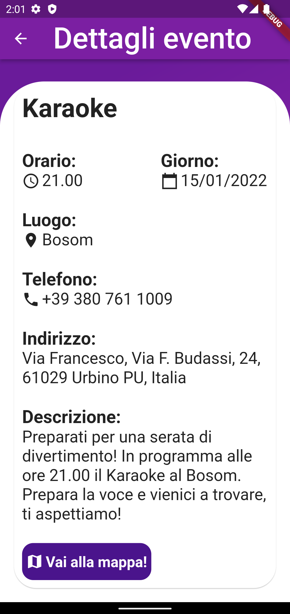</a>
  </row>

### Mappa ###
All'interno della schermata Dettagli evento, se la richiesta HTTP è andata a buon fine, verrà recuperata grazie all'API anche la posizione del locale nel quale si svolgerà l'evento, e di conseguenza verrà visualizzato un pulsante che indirizzerà ad una mappa, indicante la relativa posizione.

  <row>
    <a>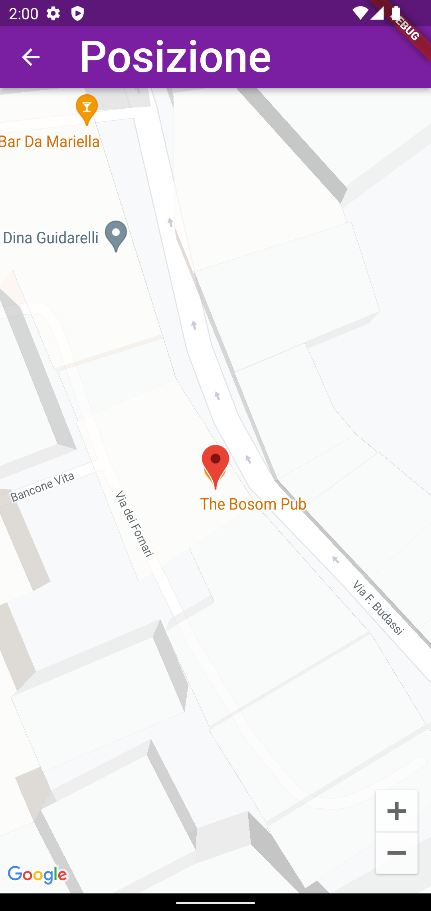</a>
  </row>

### App Drawer ###
Rispettivamente nelle schermate Home e Pannello Admin, in base alla tipologia di utente, verrà visualizzato un Drawer.

  <row>
    <a>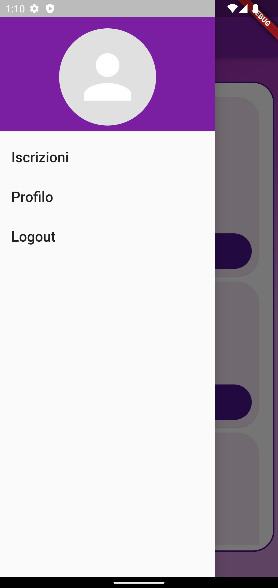</a>
    <a>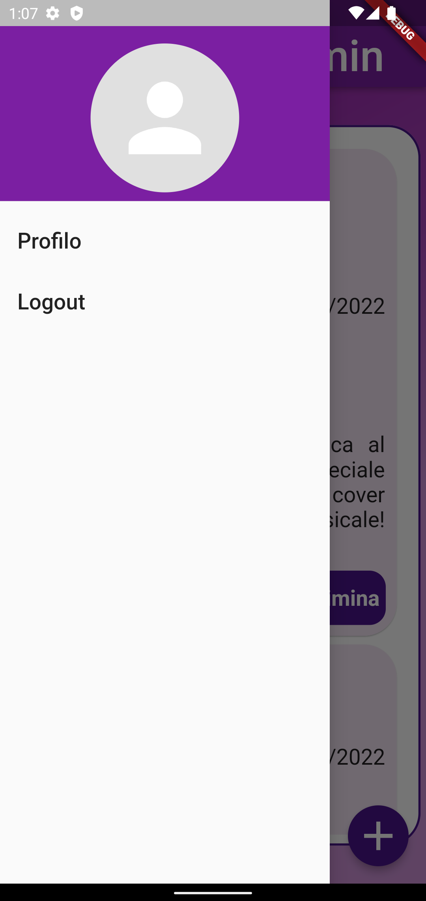</a>
  </row>

### Profilo ###
All'interno di entrambi i Drawer sarà presente una sezione profilo, la quale consentirà all'utente di visualizzare i propri dati personali e il proprio ruolo.

  <row>
    <a>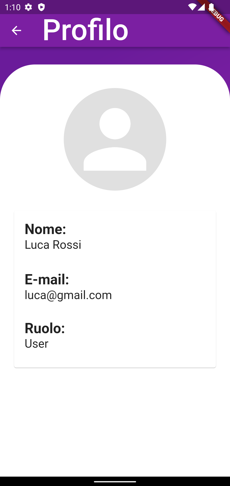</a>
  </row>

### Lista iscrizioni ###
All'interno del Drawer per l'utente di tipo User sarà possibile visualizzare una lista contenente i nomi e i relativi codici personali degli eventi a cui l'utente è iscritto fino a quel momento. La visualizzazione è resa possibile grazie ad uno StreamBuilder, il quale ne consentirà la visualizzazione aggiornata in tempo reale.

  <row>
    <a>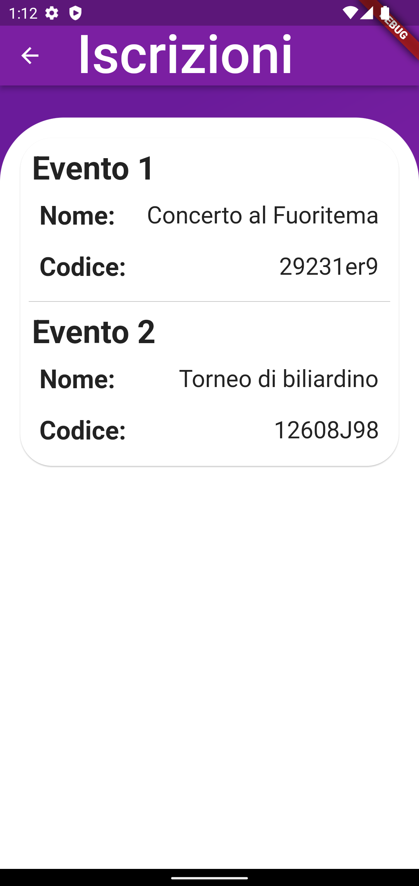</a>
  </row>

-----------------------------------------------------

## Tecnologia ##
### Funzionalità ###
  - L'applicazione è corredata di un sistema di registrazione e di login, gestito tramite Firebase. L'autenticazione viene effettuata mediante provider, e viene richiesto all'utente l'inserimento di indirizzo email e password. L'indirizzo email deve corrispondere al formato standard definito da un'espressione regolare, e la password deve essere di una lunghezza di almeno 6 caratteri, deve inoltre contenere un numero, una lettera maiuscola e un simbolo. Nel caso in cui vengano riscontrati problemi oppure errori in fase di autenticazione, l'eccezione fornita da Firebase verrà mostrata sottoforma di messaggio di errore. Viene inoltre effettuata la validazione su tutti i campi di inserimento di testo, con relativa segnalazione di errore nel caso in cui siano riscontrate difformità.
  - I dati inseriti all'interno dell'applicazione quali dati di registrazione, di creazione eventi e di iscrizione vengono gestiti con un database di Firebase. In particolare, al momento della registrazione viene creata una tabella Utente contenente i dati ricevuti. La tabella relativa all'utente loggato verrà aggiornata costantemente in tempo reale con i dati relativi alle iscrizioni agli eventi selezionati. Allo stesso modo, nel momento in cui viene creato un nuovo evento viene creata una tabella contenente i dati inseriti. La tabella relativa all'evento selezionato verrà aggiornata in tempo reale con i dati relativi agli utenti iscritti.

  <row>
    <a>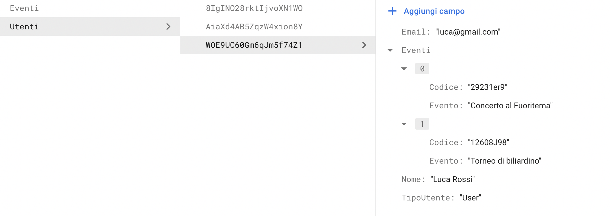</a>
    <a>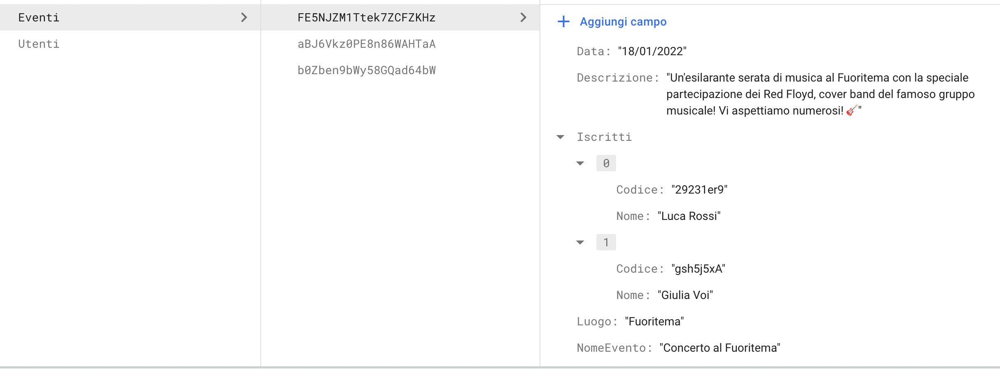</a>
  </row>

  - L'interfaccia dell'applicazione è completamente responsive, sarà dunque possibile utilizzarla nei dispositivi mobile di tipo smartphone e tablet, e inoltre browser, sia in modalità portrait, sia in modalità landscape.

  <row>
    <a>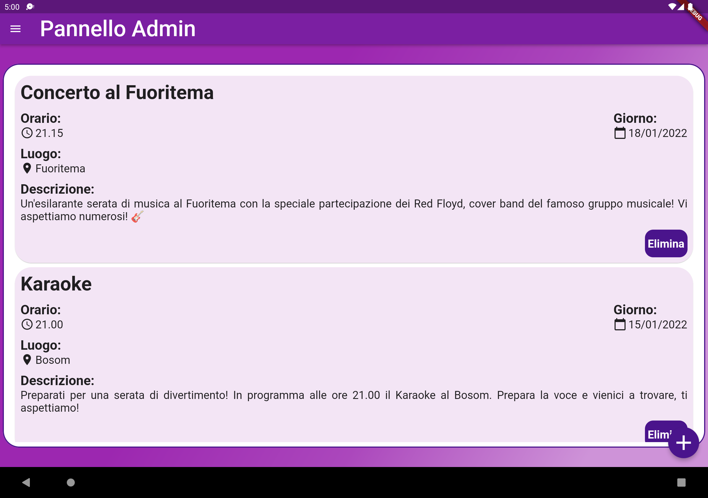</a>
  </row>

  - Oltre ai dati recuperati tramite database, all'interno della schermata di Dettaglio degli eventi sarà possibile visionare dei dati ricavati grazie alla connessione ad un servizio HTTP esterno (API REST basata sull'API Places di Google). I dati in questione saranno in particolare il numero di telefono, l'indirizzo e la posizione del locale che ospiterà l'evento selezionato. La posizione sarà inoltre utilizzata per visualizzare il locale all'interno di una mappa.
  - Ad ogni operazione effettuata ed andata a buon fine verrà visualizzato un toast di comunicazione (registrazione, login, logout, creazione evento, eliminazione evento).
  - Per l'integrazione dell'applicazione con Firebase per quanto riguarda i servizi di autenticazione e storage è stato necessario fornire del supporto specifico per tutte le piattaforme che supportano l'applicazione, in particolare andando ad integrare il servizio lato codice nativo nei file Gradle e AndroidManifest.xml per quanto riguarda Android, Info.plist e AppDelegate.swift per quanto riguarda iOS, e index.html per quanto riguarda il browser web.

### Pacchetti utilizzati ###
Per lo sviluppo dell'applicazione sono stati utilizzati i seguenti pacchetti:

  - <b>firebase_core:</b> necessario al collegamento a Firebase, utile per permettere di utilizzarne le API e i relativi servizi offerti
  - <b>firebase_auth:</b> utile all'utilizzo dei servizi di autenticazione di Firebase
  - <b>cloud_firestore:</b> utile all'utilizzo dei servizi di database di Firebase
  - <b>provider:</b> utilizzato per gestire il processo di autenticazione e di registrazione di un utente
  - <b>random_string:</b> utilizzato per la generazione del codice personale dell'utente in fase di iscrizione ad un evento
  - <b>fluttertoast:</b> necessario per la visualizzazione dei toast di completamento delle operazioni
  - <b>http:</b> necessario per effettuare il collegamento ad un servizio esposto da un'API REST e per effettuarne il relativo parsing dei dati
  - <b>google_maps_flutter:</b> utilizzato per la costruzione e la visualizzazione della mappa contenente la posizione del locale organizzatore dell'evento
  - <b>json_serializable:</b> utile alla gestione dei JSON ricavati dal collegamento al servizio esposto da un'API REST

### Compatibilità ###
L'applicazione è compatibile con dispositivi mobile di tipo smartphone o tablet, dotati di Sistema Operativo Android e iOS. In particolare, per quanto riguarda Android, saranno supportate le versioni con SDK pari o superiore a 20 (Android 4.4), mentre per quanto riguarda iOS saranno supportate le versioni pari o superiori ad iOS 10.0. L'app è inoltre compatibile con sistemi Web, in particolare con il browser Google Chrome.

-----------------------------------------------------

### Link e riferimenti ###
- Link API utilizzata per reperire i dati dei locali (esempio):
  * https://letsorderapi.herokuapp.com/?tipo=diretto&lista=undergroundurbino

